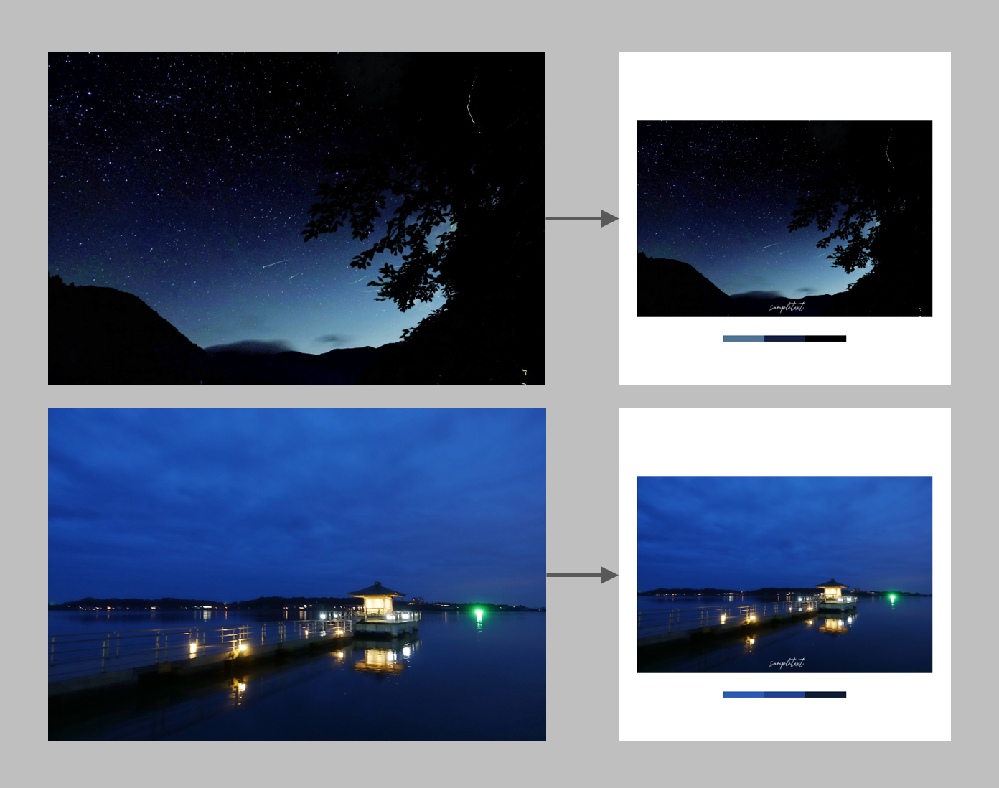

# Feed Maker for Instagram
This is an implementation that generates a descent feed in Instagram.

これはインスタグラムでいい感じのフィードを生成するプログラムの実装です。

Specifically, as shown in the following picture, three representative colors are extracted by K-means clustering, and an image with a white frame and signature is generated.

具体的には以下の写真のように、K-meansクラスタリングで代表色を3色抽出し、白枠と署名を付けた画像を生成します。

<p align="left">

</p>

Anyone can use it freely as long as they have an environment to run Python and any font file.

Pythonを動かす環境と適当なフォントファイルがあれば誰でも自由に利用できます。

If you like, please feel free to post them with "#my_divingram".

もしよろしければ「#my_divingram」をつけて是非投稿してください。


## Requirements
* Python 3.7+
* Pillow 5.3+
* Numpy 1.16+
* Scipy 1.1+

## Usage
1. Put any font file in the `font` directory.
適当なフォントファイルを`font`ディレクトリに配置します。

2. Change lines 11 and 12 of `main.py` to the appropriate signature and path.
`main.py`の11,12行目を適切な署名とパスに変更します。

3. Put the input images in the `input` folder.
入力画像を`input`フォルダに配置します。

4. Execute the following command.
以下のコマンドを実行します。
```
python main.py
```